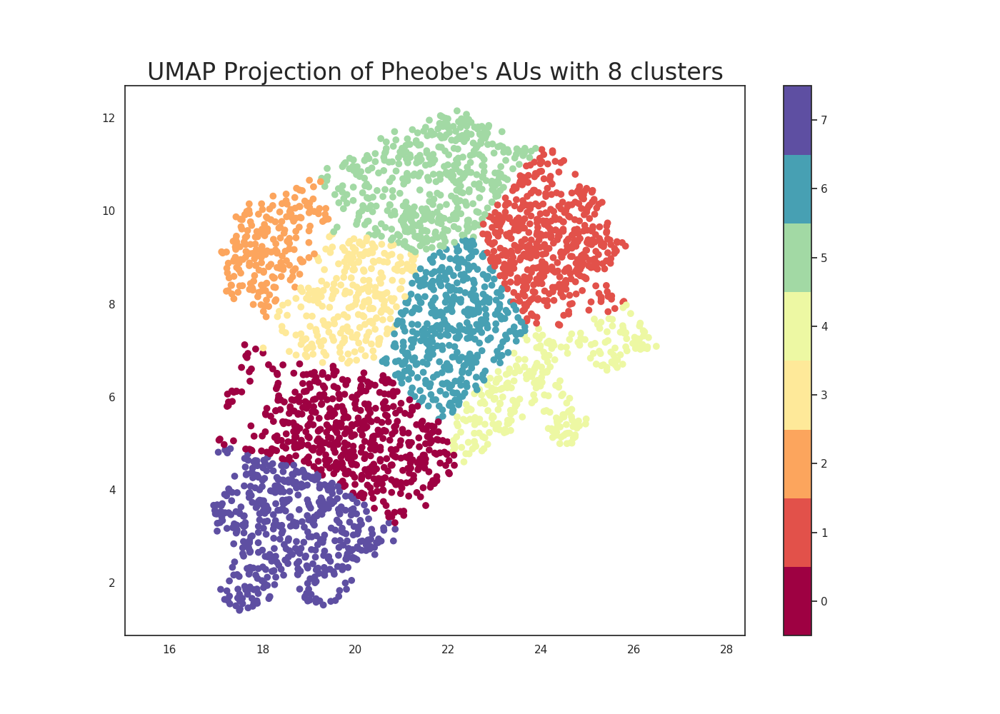

# cmpt419-special-topics-ai-clustering-and-visualization-phoebe

This project was completed during the "Special Topics in Artificial Intelligence: Affective Computing" course taken at SFU
http://www.sfu.ca/outlines.html?2020/summer/cmpt/419/d100

In this project, I was given static image-based data of facial expressions from Phoebe Buffay from the T.V. show, Friends. 
Using this data, I analyzed the facial action units (AU), and input AUs into a gaussian mixture model (GMM) which is a soft clustering algorithm.
Optimally, 8 clusters were found, each determining a distinct mood for Pheobe. An example of clusters can be seen below. 

First, we see happy (high activation) in purple, next to excitement/surprise in red.
I hypothesized two clusters sharing a border will share similar emotional states. 
Using the first two emotions as an example, happiness is quite similar to excitement/surprise.
In yellow is sadness, bluish green is happy (low activation)/embarassment. 
Embarassment can might be linked to sadness, and might be similar to excitement in red.
Lime green is contempt, maybe linking with embarassment and excitement at borders, and orange being fear/neutral expressions. F
ear/Neutral seems link a strange mix, we could call it low activation fear.
Green is upset/anger, and light orange is disgust.

It is interesting to see happiness (high activation) at one end of data cluster, and upset, disgust, fear, and sadness at the other end.

Please see the project report in [a2.ipynb](https://github.com/compSciKai/cmpt419-special-topics-ai-clustering-and-visualization-phoebe/blob/master/a2.ipynb) (Takes a few seconds to render in the browser. Press 'reload' if does not render on first try.)
